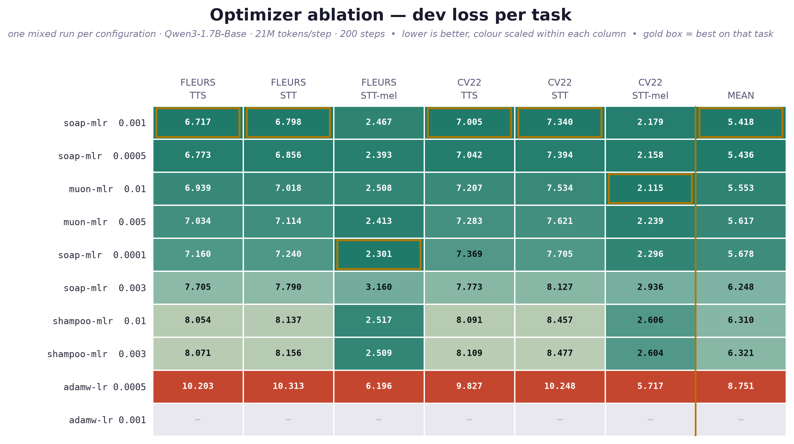
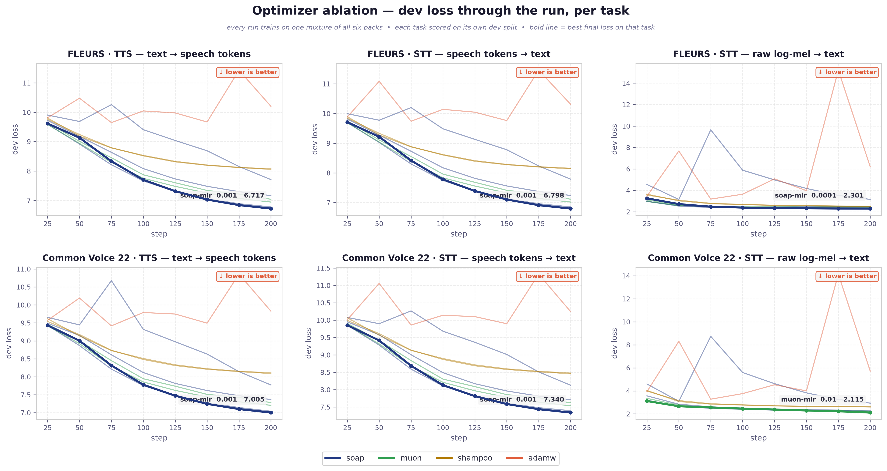
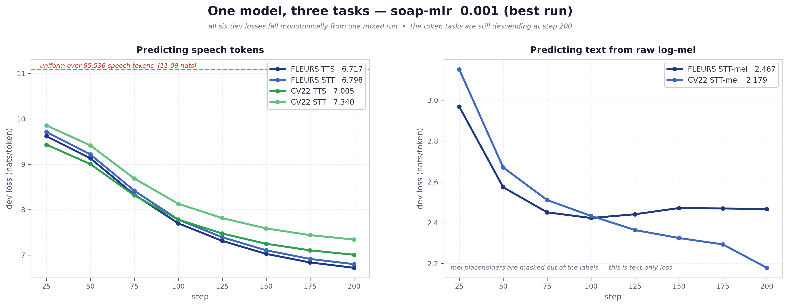

# Multilingual-Speech-Model

Qwen3 backbones continued-pretrained on [NeuCodec](https://github.com/neuphonic/neucodec)
speech tokens at 50 TPS. The model speaks and listens: text-to-speech and voice cloning in
150+ languages, speech-to-text from either speech tokens or raw whisper log-mel, plus
expressive and non-verbal control.

> **V1 — the TTS-only era — lives in [README_V1.md](README_V1.md)**: released checkpoints,
> the 76-language CER/MOS and speaker-similarity benchmarks, the base and expressive
> datasets, and the one-epoch and learning-rate ablations.

## The three tasks

Every task is one packed document. Audio arrives as codec tokens or as raw mel, both at
50 positions per second, so the same utterance costs the same context either way.

```
TTS        speaker: text              ->  <|speech_start|> s₀ s₁ s₂ … sₙ
STT        s₀ s₁ s₂ … sₙ              ->  <|lang|> text
STT (mel)  ░░ 128-bin log-mel ░░      ->  <|lang|> text
```

Documents are greedily packed into 10,240-token blocks and kept attention-isolated:
`position_ids` reset per document, `attention_mask` carries per-document lengths, and the
trainer rebuilds a block-diagonal mask. Nothing attends across a document boundary.

```
audio + text
   ├─ NeuCodec, 50 TPS ──→ <|s_N|> tokens ─┐
   └─ whisper log-mel ───→ <|mel|> slots ──┤
                                           ├─→ 10,240-token blocks
                                           └─→ ChiniDataset parquet
```

## Evaluation

### [Low-Resource Language Test Set](low-language-testset/README.md)

A held-out test set for the long tail: the 50 lowest-resource languages of
[malaysia-ai/Multilingual-TTS](https://huggingface.co/datasets/malaysia-ai/Multilingual-TTS),
25 utterances each. 1,250 rows, 2.56 hours, 514 speakers, published as
[malaysia-ai/Low-Language-TTS](https://huggingface.co/datasets/malaysia-ai/Low-Language-TTS).

Every row carries audio, NeuCodec tokens and a normalized transcription, so it scores both
directions. Coverage runs from Wayuu (1,128 rows in the whole corpus) to Kasem (61,277),
and takes in Naga varieties, Quichua, Gronings, Baoulé, Karamojong, Iban, Meitei,
Tamazight, Lule Sami, Ladino, Khasi, Hawrami, Kokborok, Kabardian, Vagla and Swiss German.

Languages are not picked by taking the rarest GlotLID labels. Only 3 of the 500 rarest
labels survive verification on this corpus: that tail is mostly the detector firing on
short lines of other languages. A language qualifies when some subset was collected for it
(≥ 50 rows and ≥ 40% of that subset). Each row is then verified on its own:

```
≥ 40 characters and ≥ 5 words
GlotLID v3 reproduces the stored label, probability ≥ 0.90, margin ≥ 0.50
decoded audio length matches len(tokens) / 50
```

**Preparation:** [low-language-testset](low-language-testset)

## Dataset

### Base

Voice cloning, multi-speaker and multilingual: **37.34B tokens** over six packed corpora,
up from 35.88B in [V1](README_V1.md#base). The increase is YouTube-Cantonese-Emilia.

| corpus | blocks | tokens |
|---|---:|---:|
| Emilia-YODAS | 1,902,702 | ~19.48B |
| Malaysian-Emilia | 775,589 | ~7.94B |
| Malaysian-Emilia-dialects | 565,604 | ~5.79B |
| Malaysian-Chinese-Emilia | 178,271 | ~1.83B |
| YouTube-Cantonese-Emilia | 142,711 | ~1.46B |
| Malaysian-Tamil-Emilia | 81,723 | ~0.84B |
| **total** | **3,646,600** | **~37.34B** |

Blocks × 10,240; greedy packing puts true counts slightly below. Malaysian-Emilia and
Malaysian-Emilia-dialects are two disjoint configs of one HF repo, not one corpus counted
twice. Per-dataset configs, reject filters and pack targets: [preparation/README.md](preparation/README.md).

The TTS source corpus `malaysia-ai/Multilingual-TTS` now holds **121.8M rows across 1,552
subsets** (4.64TB of audio zips and NeuCodec tokens), up from the 25.35B-token pack V1
trained on.

**Sources:** [Multilingual-TTS](https://huggingface.co/datasets/malaysia-ai/Multilingual-TTS) ·
[Emilia-YODAS-Voice-Conversion](https://huggingface.co/datasets/Scicom-intl/Emilia-YODAS-Voice-Conversion) ·
[Malaysian-Emilia](https://huggingface.co/datasets/Scicom-intl/Malaysian-Emilia) ·
[YouTube-Cantonese-Emilia](https://huggingface.co/datasets/Scicom-intl/YouTube-Cantonese-Emilia)

**Preparation:** [preparation](preparation)

### Non-verbal Tags

Laughter, cough, sigh and similar events, mined with PANNs SED, verified with CLAP, and
placed by whisper word timestamps. Two renderings per row: Higgs-TTS style
(`<|sfx:laughter|>Haha`) and Emilia-NV style (`[Laughter]`).

| source | output | rows | events |
|---|---|---:|---:|
| [Malaysian-Emilia](https://huggingface.co/datasets/Scicom-intl/Malaysian-Emilia) | [Malaysian-Emilia-Nonverbal-Tags](https://huggingface.co/datasets/Scicom-intl/Malaysian-Emilia-Nonverbal-Tags) | 8,702 | 8,985 |
| [Malaysian-Tamil-Emilia](https://huggingface.co/datasets/Scicom-intl/Malaysian-Tamil-Emilia) | [Malaysian-Tamil-Emilia-Nonverbal-Tags](https://huggingface.co/datasets/Scicom-intl/Malaysian-Tamil-Emilia-Nonverbal-Tags) | 2,383 | 2,539 |
| [Malaysian-Chinese-Emilia](https://huggingface.co/datasets/Scicom-intl/Malaysian-Chinese-Emilia) | [Malaysian-Chinese-Emilia-Nonverbal-Tags](https://huggingface.co/datasets/Scicom-intl/Malaysian-Chinese-Emilia-Nonverbal-Tags) | 1,655 | 1,694 |

**Preparation:** [nonverbal-tagging](nonverbal-tagging)

### Speech-to-Text

The inverse task, in two packs — one per audio representation.

| pack | document | audio as |
|---|---|---|
| `multipacking_stt.py` | `<\|im_start\|><\|STT\|>{speech tokens}<\|{lang}\|>{text}<\|im_end\|>` | NeuCodec `<\|s_N\|>`, 50 tokens/s |
| `multipacking_stt_mel.py` | `<\|im_start\|><\|STT\|><\|mel_start\|>{P × <\|mel\|>}<\|mel_end\|><\|{lang}\|>{text}<\|im_end\|>` | whisper log-mel, 50 positions/s |

Same rate, same context cost. The codec's information loss is the only difference.

**Source:** [malaysia-ai/Multilingual-TTS-language](https://huggingface.co/datasets/malaysia-ai/Multilingual-TTS-language),
118M rows over 1,493 subsets, with GlotLID v3 `language` and rule-normalized
`post-normalized` columns.

**Preparation:** [stt](stt)

## Ablation

### Optimizer search

[hyperparameter_search.py](hyperparameter_search.py) drives
[qwen3_optimizer_search.py](qwen3_optimizer_search.py), a trainer with a pluggable
optimizer. Each optimizer gets its own LR grid.

| optimizer | applied to | swept LRs |
|---|---|---|
| `adamw` | everything | 5e-4 · 1e-3 · 2e-3 |
| `muon` | 2D hidden weights (AdamW on the rest) | matrix 5e-3 · 1e-2 · 2e-2 |
| `soap` | 2D hidden weights (AdamW on the rest) | matrix 1e-3 · 3e-3 · 1e-2 |
| `shampoo` ([ScalableShampoo](https://github.com/kozistr/pytorch_optimizer)) | 2D hidden weights (AdamW on the rest) | matrix 5e-4 · 1e-3 · 3e-3 |
| `lion` | everything | 1e-4 · 3e-4 (wd 0.1) |
| `ademamix` | everything | 5e-4 · 1e-3 |

Hybrids use Muon's 2D-hidden-weight split ("Muon is Scalable for LLM Training",
arXiv:2502.16982), so the comparison is like for like. Runs resume by name from
`search_state/<prefix>/<run>.json`.

```bash
pip install pytorch_optimizer            # shampoo / soap / lion / ademamix

python hyperparameter_search.py --train-file <pack dir>
python hyperparameter_search.py --train-file <pack dir> --optimizers muon soap
python hyperparameter_search.py --train-file <pack dir> --dry-run
```

Those are the built-in grids. A `--grid-json` file replaces them and defines the sweep —
the FLEURS sweep below uses one. Name every sweep with `PREFIX`: run names carry
the optimizer and LRs but not the batch size, so two sweeps at different batches share
resume markers and the second one silently reprints the first one's ranking.

#### FLEURS-R + Common Voice 22 — optimizer ablation

**Question.** Which optimizer trains a model that does all three tasks at once, and does
a small corpus even support that?

**Setup.** One run trains on a mixture of all six packs. Each task is then scored on its
own dev split.

```
 fleurs-tts  ┐                                              ┌ eval_fleurs_tts
 fleurs-stt  │                                              │ eval_fleurs_stt
 fleurs-mel  ├─→  561,123 blocks  ─→  200 steps        ─→   ├ eval_fleurs_mel
 cv22-tts    │    mixed 1:1:1:1:1:1   21M tokens/step       │ eval_cv22_tts
 cv22-stt    │                        Qwen3-1.7B-Base       │ eval_cv22_stt
 cv22-mel    ┘                                              └ eval_cv22_mel
```

| pack | train blocks | dev blocks |
|---|---:|---:|
| `fleurs-tts` | 18,148 | 2,231 |
| `fleurs-stt` | 17,984 | 2,208 |
| `fleurs-mel` | 18,026 | 2,213 |
| `cv22-tts` | 166,130 | 12,321 |
| `cv22-stt` | 158,979 | 11,778 |
| `cv22-mel` | 181,856 | 13,934 |

- **FLEURS-R** — [malaysia-ai/fleurs-r-neucodec-all-languages](https://huggingface.co/datasets/malaysia-ai/fleurs-r-neucodec-all-languages).
  102 locales, 248,117 train and 31,378 dev utterances.
- **Common Voice 22** — the filtered 6,921,399 rows of `common-voice-22` in
  [malaysia-ai/Multilingual-TTS](https://huggingface.co/datasets/malaysia-ai/Multilingual-TTS),
  29.1% of raw CV22. Tokens and audio from
  [malaysia-ai/common_voice_22_0](https://huggingface.co/datasets/malaysia-ai/common_voice_22_0).

All six packs cover the same rows, so only the representation and the direction change.
5.75B tokens total. A 200-step run sees 4.2B of them, so nothing is replayed.

CV22 adds 130 language tags to FLEURS' 102, and the mel tokens are appended after the
language tags. Packing the corpora separately would shift `<|mel|>`'s id between them, so
both packers read one shared 236-token list.

```bash
python preparation/multipacking_cv22.py --base-dir <cv22> --stage tokens-file
python preparation/multipacking_cv22.py --base-dir <cv22> --stage tokens   # 6.1GB
python preparation/multipacking_cv22.py --base-dir <cv22> --stage audio    # 286GB, filtered rows only
python preparation/multipacking_cv22.py --base-dir <cv22> --task all --workers 96
python preparation/multipacking_fleurs.py --base-dir <base> --task all \
    --added-tokens-file <cv22>/out/added_tokens.json --audio-base <audio>
bash preparation/link_audio_root.sh      # one audio root for both corpora
PREFIX=fleurs-b2040 bash scripts/ablation-fleurs.sh
python plot_fleurs_ablation.py --out-dir docs
```

**Protocol.** Qwen3-1.7B-Base, 21M tokens/step, warmup 50, FP32-BF16, WSD LR, 200 steps.
Two departures from V1:

| | V1 | here | why |
|---|---|---|---|
| steps | 100 | 200 | the V1 winner separates only after ~step 50 and is still descending at 100 |
| batch shape | 8 × 32 | 4 × 64 | micro-batch 8 peaks a rank at 143,137 MiB of a 143,771 MiB card |

Ten configurations ran. Nine finished; `adamw 1e-3` diverged.



Colour is scaled within each column, because the tasks do not share a scale: TTS and
token-STT predict into 65,536 speech tokens, the mel tasks predict text. Runs rank on the
mean so no single scale decides the order. Full table: [docs/fleurs-ablation-results.md](docs/fleurs-ablation-results.md).



##### What the sweep says

1. **Second-order methods win by a wide margin.** SOAP and Muon beat the best AdamW by
   3.2–3.3 nats on every one of the six tasks. Nothing about that is marginal.
2. **AdamW at the V1 aggressive LR diverges.** When warmup ends and the LR parks at its
   1e-3 peak, `grad_norm` goes 272 → 45,610 despite clipping at 1.0, and every dev curve
   reverses. At 5e-4 it survives but oscillates — its final losses sit 0.4–3.0 nats above
   its own best. The red lines in the figure above are that failure.
3. **The leaders are flat in LR, so the choice is not delicate.** SOAP is within 0.02
   across 5e-4 → 1e-3; Muon within 0.06 across 5e-3 → 1e-2; Shampoo within 0.01 across
   3e-3 → 1e-2. Pick anything in the band.
4. **A bigger batch did not want a bigger LR.** SOAP peaks at 1e-3 and degrades both above
   it (3e-3 costs 0.83) and below it (1e-4 costs 0.26), at both batch sizes tried. The
   usual scaling intuition does not hold here.
5. **The best optimizer is task-dependent at the margins.** SOAP 1e-3 wins four tasks,
   SOAP 1e-4 wins FLEURS mel, Muon 1e-2 wins CV22 mel. Lower LRs favour the mel tasks.
   A single averaged number hides this, which is why every task gets its own column.
6. **The screen mis-ranked everything except SOAP.** 16 configs at 48 blocks/step put the
   three leaders within 0.03 and AdamW 1.2 nats back. At the real batch the leaders spread
   over 0.26 and AdamW falls 3.3 behind. Screens at 1/43 of the batch order optimizers by
   luck. The screen numbers are kept in [docs/fleurs-screen-48blocks.md](docs/fleurs-screen-48blocks.md).

##### Can one model learn all three tasks from this much data?

Yes. The best run's six dev losses all fall monotonically, from one mixture, in 200 steps.



| task | step 25 | step 200 | drop | perplexity |
|---|---:|---:|---:|---:|
| FLEURS TTS | 9.617 | 6.717 | 2.900 | 826 |
| FLEURS STT | 9.711 | 6.798 | 2.913 | 896 |
| FLEURS STT-mel | 2.968 | 2.467 | 0.501 | 11.8 |
| CV22 TTS | 9.432 | 7.005 | 2.428 | 1,102 |
| CV22 STT | 9.855 | 7.340 | 2.515 | 1,540 |
| CV22 STT-mel | 3.150 | 2.179 | 0.971 | 8.8 |

Read against the uniform baselines: speech-token prediction starts from ln(65,536) = 11.09
nats and ends at 6.72, so perplexity drops from 65,536 to 826. Text from raw mel ends at
8.8–11.8 perplexity against a 217,448-token vocabulary. No task is starved by the others.

Three qualifications:

- **Not converged.** The token tasks still drop ~0.10 nats per 25 steps at step 200.
  4.2B tokens buys a clear signal, not a finished model.
- **The mel number is not comparable to the token-STT number.** `<|mel|>` placeholders are
  masked out of the labels, since audio is an input, not a prediction target. So the mel
  task scores text only, while token-STT also scores the ~90% of positions that are speech
  tokens. A codec-vs-mel comparison needs a text-only metric on the token side.
- **FLEURS mel flattens after step 100 while CV22 mel keeps falling.** FLEURS is 9.6% of
  the mixture. The small corpus rides along on the large one rather than driving it.

## Training

### TTS + STT + raw mel

```bash
# 0.6B
bash scripts/0.6B-mel.sh

# 1.7B
bash scripts/1.7B-mel.sh
```

The mix is a launch flag, not a property of the data. `--train_file` takes `dir:weight`
entries, where the weight is how many epochs of that pack go into one training epoch, so
ratios change without repacking. The mel pack stores audio *paths*: point `--audio_dir` at
the extracted audio tree. Files are read and resampled in the dataloader workers, and the
STFT runs on the GPU.

Weight the mel pack down on purpose. It makes micro-batches with no mel document common,
which is the case that hangs DDP if the projector leaves the autograd graph.

**Smoke test** — synthetic packs for all three tasks, built with the real tokenizer, so
every id is the id training would see:

```bash
python dryrun_pack.py --out /root/share/mel-dryrun
torchrun --nproc_per_node 2 -m qwen3_mel_adamw \
  --model_name_or_path Qwen/Qwen3-0.6B-Base \
  --stt_tokens_file /root/share/mel-dryrun/stt_added_tokens.json \
  --audio_dir /root/share/mel-dryrun/audio \
  --train_file "/root/share/mel-dryrun/multipacking-tts:1.0,/root/share/mel-dryrun/multipacking-stt:1.0,/root/share/mel-dryrun/multipacking-stt-mel:0.3" \
  --block_size 10240 --max_steps 20 --do_train --bf16 --torch_dtype float32 \
  --per_device_train_batch_size 2 --gradient_checkpointing true \
  --ddp_find_unused_parameters false --remove_unused_columns false \
  --output_dir /root/share/mel-dryrun/out --logging_steps 1 --save_strategy no
```

### Raw mel input

Audio reaches the LLM with no speech tokenizer and no whisper *encoder*. Only whisper's
mel front end survives; the LLM does the acoustic modelling.

```
waveform 16kHz
  └─ whisper log-mel          100 fps, 128 bins   (feature extractor unchanged)
      └─ stack 2 frames       [T/2, 256]
          └─ LayerNorm → Linear(256→H) → GELU → Linear(H→H)
              └─ 50 positions/s, written over the <|mel|> placeholder embeddings
```

Stack, don't pool. A reshape of 2 frames preserves information and equals
`Conv1d(128, H, kernel_size=2, stride=2)`. An average pool commits to one fixed mixing and
low-passes away the ~10ms cues — plosive bursts, stop closures, onset edges — that
separate phonemes. Qwen2-Audio can pool because its stride-2 pool sits after 32 transformer
layers that already made neighbouring positions redundant. With no encoder, adjacent mel
frames are not redundant. 50 positions/s is also whisper's own encoder output rate, and the
NeuCodec rate.

Implementation: [mel_audio.py](mel_audio.py), [qwen3_mel_adamw.py](qwen3_mel_adamw.py).
Tests: [stt/test_mel_pipeline.py](stt/test_mel_pipeline.py).

## Areas

| area | what |
|---|---|
| [preparation](preparation/README.md) | multipacking: (text, speech-token) pairs → 10,240-token attention-isolated blocks |
| [stt](stt/README.md) | the inverse task, in two packs: NeuCodec tokens and raw log-mel |
| [fleurs-dataset](fleurs-dataset/README.md) | FLEURS-R + NeuCodec tokens for 102 locales, and the speaker labels derived for it |
| [low-language-testset](low-language-testset/README.md) | the long-tail test set |
| [nonverbal-tagging](nonverbal-tagging/README.md) | non-verbal event mining into inline tags |
| [synthetic-description](synthetic-description/README.md) | expressive-TTS descriptions: acoustic stats + classifiers → LLM summary |
| [dnsmos](dnsmos/README.md) | DNSMOS quality filtering |
| [tts-evaluation](tts-evaluation/README.md), [vc-evaluation](vc-evaluation/README.md) | the 76-language benchmarks (V1) |

## Acknowledgements

1. [Malaysia-AI](https://huggingface.co/malaysia-ai) for the large-scale TTS dataset: https://huggingface.co/datasets/malaysia-ai/Multilingual-TTS
2. [Scitix](https://www.scitix.ai/) for H100 node access
