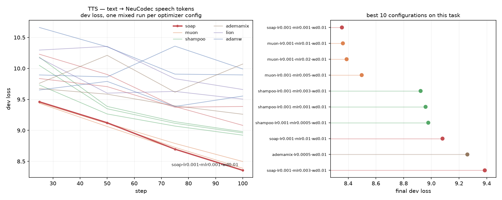
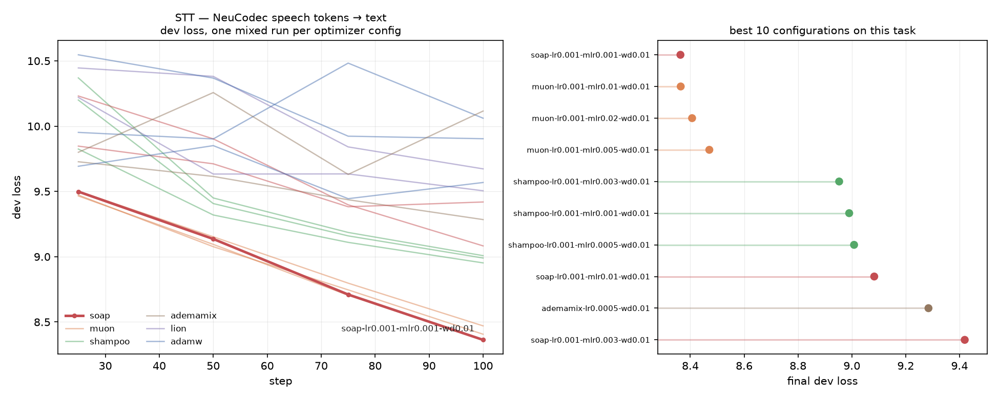
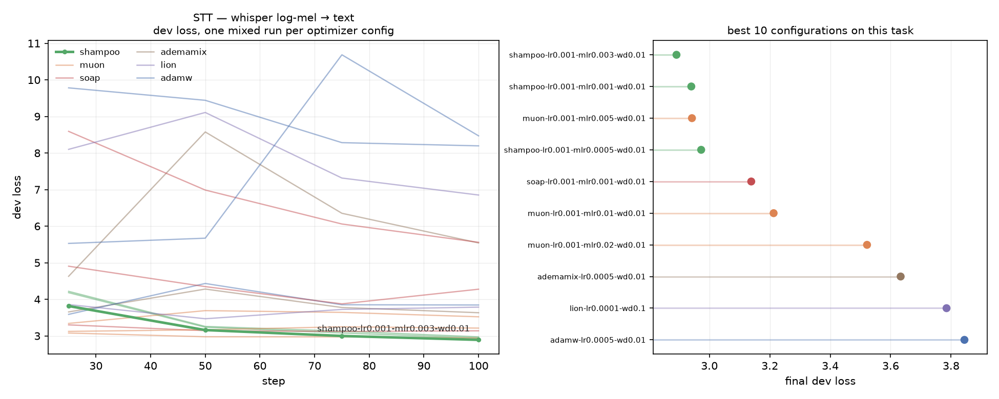

# Multilingual-Speech-Model

Open-source multilingual **speech** models built on [NeuCodec](https://github.com/neuphonic/neucodec)
speech tokens at 50 TPS — Qwen3 backbones continued-pretrained to both **speak and listen**:
text-to-speech and voice cloning across 150+ languages, speech-to-text as the inverse task
(from speech tokens or from raw whisper log-mel), plus expressive and non-verbal control.

> **V1 — the TTS-only era — is in [README_V1.md](README_V1.md)**: released checkpoints, the
> 76-language CER/MOS and speaker-similarity benchmarks, the base/expressive datasets, the
> one-epoch and learning-rate ablations, and the base/expressive training recipes.

## Evaluation

### [Low-Resource Language Test Set](low-language-testset/README.md)

A held-out test set for the **long tail** of the training corpus: the 50 lowest-resource
languages of [malaysia-ai/Multilingual-TTS](https://huggingface.co/datasets/malaysia-ai/Multilingual-TTS),
25 utterances each — 1,250 rows, 2.56 hours, 514 speakers, published as
[malaysia-ai/Low-Language-TTS](https://huggingface.co/datasets/malaysia-ai/Low-Language-TTS).

Every row carries **audio + NeuCodec tokens + normalized transcription**, so it scores both
directions: TTS/VC (generate from the text, CER against it) and STT (tokens in, text out).
Coverage runs from Wayuu (1,128 rows in the whole corpus) to Kasem (61,277), taking in
Naga varieties, Quichua, Gronings, Baoulé, Karamojong, Iban, Meitei, Tamazight, Lule Sami,
Ladino, Khasi, Hawrami, Kokborok, Kabardian, Vagla and Swiss German along the way.

Languages are **not** picked by taking the rarest GlotLID labels — measured on this corpus,
only 3 of the 500 rarest labels survive verification, because that tail is the detector
firing on short lines of other languages. A language qualifies when some subset was
*collected for it* (≥ 50 rows and ≥ 40% of that subset), and each row is then verified
individually: ≥ 40 chars and ≥ 5 words, GlotLID v3 reproducing the stored label at
probability ≥ 0.90 and margin ≥ 0.50, and the decoded audio length matching `len(tokens) / 50`.

**Preparation:** [low-language-testset](low-language-testset)

## Dataset

### Base

Growing — the TTS corpus and the voice-conversion pairs both gained data since V1.

**Sources**

1. https://huggingface.co/datasets/malaysia-ai/Multilingual-TTS
2. https://huggingface.co/datasets/Scicom-intl/Emilia-YODAS-Voice-Conversion
3. https://huggingface.co/datasets/Scicom-intl/Malaysian-Emilia
4. https://huggingface.co/datasets/Scicom-intl/YouTube-Cantonese-Emilia

**Size**

Multi-speaker multilingual Voice Cloning — **37.34B tokens** over six packed corpora,
up from 35.88B in [V1](README_V1.md#base): the increase is YouTube-Cantonese-Emilia's
1.46B (blocks × 10,240; greedy packing, so true counts sit slightly below).

| corpus | blocks | tokens |
|---|---:|---:|
| Emilia-YODAS | 1,902,702 | ~19.48B |
| Malaysian-Emilia | 775,589 | ~7.94B |
| Malaysian-Emilia-dialects | 565,604 | ~5.79B |
| Malaysian-Chinese-Emilia | 178,271 | ~1.83B |
| YouTube-Cantonese-Emilia | 142,711 | ~1.46B |
| Malaysian-Tamil-Emilia | 81,723 | ~0.84B |
| **total** | **3,646,600** | **~37.34B** |

Per-dataset configs, reject filters and pack targets are in
[preparation/README.md](preparation/README.md).

Multi-speaker multilingual TTS, 150+ languages — the source corpus
`malaysia-ai/Multilingual-TTS` is now **121.8M rows across 1,552 subsets** (4.64TB of audio
zips + NeuCodec tokens), up from the 25.35B-token pack V1 trained on.

**Preparation:** [preparation](preparation)

### Non-verbal Tags

Inline non-verbal event tags (laughter, cough, sigh, ...) mined from the Emilia-style corpora with
PANNs SED + CLAP verification + whisper word-timestamp placement, in two renderings per row:
Higgs-TTS style (`<|sfx:laughter|>Haha`) and Emilia-NV style (`[Laughter]`).

**Sources → outputs**

1. [Malaysian-Emilia](https://huggingface.co/datasets/Scicom-intl/Malaysian-Emilia) → [Malaysian-Emilia-Nonverbal-Tags](https://huggingface.co/datasets/Scicom-intl/Malaysian-Emilia-Nonverbal-Tags) — 8,702 rows / 8,985 events
2. [Malaysian-Tamil-Emilia](https://huggingface.co/datasets/Scicom-intl/Malaysian-Tamil-Emilia) → [Malaysian-Tamil-Emilia-Nonverbal-Tags](https://huggingface.co/datasets/Scicom-intl/Malaysian-Tamil-Emilia-Nonverbal-Tags) — 2,383 rows / 2,539 events
3. [Malaysian-Chinese-Emilia](https://huggingface.co/datasets/Scicom-intl/Malaysian-Chinese-Emilia) → [Malaysian-Chinese-Emilia-Nonverbal-Tags](https://huggingface.co/datasets/Scicom-intl/Malaysian-Chinese-Emilia-Nonverbal-Tags) — 1,655 rows / 1,694 events

**Preparation:** [nonverbal-tagging](nonverbal-tagging)

### Speech-to-Text

The inverse task, so one model both speaks and listens. Two packs of the same task, one
per audio representation:

| pack | document | audio as |
|---|---|---|
| `multipacking_stt.py` | `<\|im_start\|><\|STT\|>{speech tokens}<\|{lang}\|>{text}<\|im_end\|>` | NeuCodec `<\|s_N\|>` tokens, 50 tokens/s |
| `multipacking_stt_mel.py` | `<\|im_start\|><\|STT\|><\|mel_start\|>{P × <\|mel\|>}<\|mel_end\|><\|{lang}\|>{text}<\|im_end\|>` | raw whisper log-mel, 50 positions/s |

Both run at 50 positions/s, so the same audio costs the same context either way and the
codec's information loss is the only thing that differs between them.

**Sources**

1. https://huggingface.co/datasets/malaysia-ai/Multilingual-TTS-language — 118M rows,
   1493 subsets, with GlotLID v3 `language` and rule-normalized `post-normalized` columns

**Preparation:** [stt](stt)

## Ablation

### Optimizer search

The V1 grid scripts only covered Muon+AdamW, so the harness was rebuilt around a
pluggable-optimizer trainer: [hyperparameter_search.py](hyperparameter_search.py) drives
[qwen3_optimizer_search.py](qwen3_optimizer_search.py) and sweeps each optimizer over its
own LR grid under the identical 100-step setup as the
[V1 hyperparameter search](README_V1.md#hyperparameter-search).

| optimizer | placement | swept LRs |
|---|---|---|
| `adamw` | everything | 5e-4 · 1e-3 · 2e-3 |
| `muon` | 2D hidden weights (AdamW on embeddings/head/rest) | matrix 5e-3 · 1e-2 · 2e-2 |
| `shampoo` ([ScalableShampoo](https://github.com/kozistr/pytorch_optimizer)) | 2D hidden weights (AdamW on rest) | matrix 5e-4 · 1e-3 · 3e-3 |
| `soap` | 2D hidden weights (AdamW on rest) | matrix 1e-3 · 3e-3 · 1e-2 |
| `lion` | everything | 1e-4 · 3e-4 (wd 0.1) |
| `ademamix` | everything | 5e-4 · 1e-3 |

Hybrid optimizers use the same 2D-hidden-weight/AdamW split as Muon
("Muon is Scalable for LLM Training", arXiv:2502.16982), so the comparison is
apples-to-apples. Runs resume by name (`search_state/<run>.json`) and the harness ranks
finished runs by mean train loss over the last 10 steps into `search_state/summary.json`.

```bash
pip install pytorch_optimizer   # needed for shampoo / soap / lion / ademamix

# everything, or a subset:
python hyperparameter_search.py --train-file <multipacking dir>
python hyperparameter_search.py --train-file <multipacking dir> --optimizers muon shampoo soap
python hyperparameter_search.py --train-file <multipacking dir> --dry-run   # print commands only
```

The train file must be a ChiniDataset multipacking directory (see
[preparation](preparation)); custom grids go in `--grid-json`.

#### FLEURS-R + Common Voice 22 — one mixture, three audio tokenizers, scored per task

Every run trains on **all three ways of pairing audio with text at once**, because the
model being built has to do all three. Two corpora, six packs, all cut from the same rows
so only the representation and direction change
([preparation/multipacking_fleurs.py](preparation/multipacking_fleurs.py),
[preparation/multipacking_cv22.py](preparation/multipacking_cv22.py)):

| pack | document | train blocks | dev blocks |
|---|---|---|---|
| `fleurs-tts` | `<\|im_start\|>{speaker}: {text}<\|speech_start\|>{NeuCodec tokens}<\|im_end\|>` | 18,148 | 2,231 |
| `fleurs-stt` | `<\|im_start\|><\|STT\|>{NeuCodec tokens}<\|{locale}\|>{text}<\|im_end\|>` | 17,984 | 2,208 |
| `fleurs-mel` | `<\|im_start\|><\|STT\|><\|mel_start\|>{P × <\|mel\|>}<\|mel_end\|><\|{locale}\|>{text}<\|im_end\|>` | 18,026 | 2,213 |
| `cv22-tts` | as above, Common Voice 22 | 166,130 | 12,321 |
| `cv22-stt` | as above | 158,979 | 11,778 |
| `cv22-mel` | as above | — | — |

- **FLEURS-R**: [malaysia-ai/fleurs-r-neucodec-all-languages](https://huggingface.co/datasets/malaysia-ai/fleurs-r-neucodec-all-languages),
  102 locales, 248,117 train / 31,378 dev utterances.
- **Common Voice 22**: the filtered 6,921,399 rows of
  [malaysia-ai/Multilingual-TTS](https://huggingface.co/datasets/malaysia-ai/Multilingual-TTS)
  config `common-voice-22` — 29.1% of raw CV22 — with tokens and audio from
  [malaysia-ai/common_voice_22_0](https://huggingface.co/datasets/malaysia-ai/common_voice_22_0).
  130 language tags, ~1.7B tokens per task.

CV22 brings 130 language tags to FLEURS' 102, and the mel tokens are appended *after* the
language tags, so packing the corpora separately would shift `<|mel|>`'s id between them.
Both packers therefore take one shared 236-token list
(`multipacking_cv22.py --stage tokens-file`). Both audio representations run at 50
positions/s, so an utterance costs the same context either way
([mel_audio.py](mel_audio.py)).

```bash
python preparation/multipacking_cv22.py --base-dir <cv22> --stage tokens-file
python preparation/multipacking_cv22.py --base-dir <cv22> --stage tokens   # 6.1GB
python preparation/multipacking_cv22.py --base-dir <cv22> --stage audio    # 286GB, filtered rows only
python preparation/multipacking_cv22.py --base-dir <cv22> --task all --workers 96
python preparation/multipacking_fleurs.py --base-dir <base> --task all \
    --added-tokens-file <cv22>/out/added_tokens.json --audio-base <audio>
bash preparation/link_audio_root.sh          # one root for both corpora's audio
bash ablation-fleurs.sh                      # 6 configs
python plot_fleurs_ablation.py               # one figure per task per corpus
```

Protocol matches the published search — Qwen3-1.7B-Base, **256 blocks/GPU × 8 = 2048 ×
10,240 = 21M tokens/step**, warmup 50, FP32-BF16, WSD LR — with two changes. Runs go to
**200 steps**, because in the published search the winner separates only after ~step 50
and is still descending at 100. And the batch is reached as micro-batch 4 × 64
accumulation rather than 8 × 32: at micro-batch 8 a rank peaks at 143,137 MiB of a
143,771 MiB card, leaving nothing for anything else sharing it; micro-batch 4 peaks
~11.5GB lower for ~1% more time.

Each task is scored on its own dev split, reported separately (`eval_fleurs_tts_loss`,
`eval_cv22_mel_loss`, …) and plotted separately by
[plot_fleurs_ablation.py](plot_fleurs_ablation.py) — they never share an axis, since the
TTS task predicts 65k-way speech tokens while the STT tasks predict text. Runs rank on the
mean across tasks so no single scale decides the order.

**Screening run.** A 16-config sweep over FLEURS alone at 48 blocks/step (491k tokens,
~27% of an epoch) picked the six configurations above — muon 1e-2 · 5e-3, soap 1e-3,
shampoo 3e-3, adamw 1e-3 · 5e-4. Ranked on mean dev loss, SOAP and Muon tied at the front
(6.6189 / 6.6368 / 6.6462, within 0.03), Shampoo won raw mel outright from 5th, and AdamW
at the published aggressive LRs finished last — at that batch those rates are too high.
Treat it as a screen, not a result: `hyperparameter-search.png` shows the winning run
separating only after ~50 steps, which a 100-step run at 1/43 of the batch cannot resolve.





## Training

### TTS + STT + raw mel

One run over all three tasks — TTS from audio tokens, STT from audio tokens, and STT
from raw mel:

```bash
# 0.6B
bash 0.6B-mel.sh

# 1.7B
bash 1.7B-mel.sh
```

The mix is a launch flag, not a property of the data — `--train_file` takes
`dir:weight` entries where the weight is how many epochs of that pack go into one
training epoch, so ratios change without repacking anything. The raw-mel pack stores
audio *paths*, so `--audio_dir` must point at the extracted audio tree; the dataset reads
and resamples the files in the dataloader workers and the STFT runs on the GPU.

To smoke-test the whole thing without any real data — synthetic packs for all three
tasks, built with the real tokenizer so every id is the id training would see:

```bash
python dryrun_pack.py --out /share/mel-dryrun
torchrun --nproc_per_node 2 -m qwen3_mel_adamw \
  --model_name_or_path Qwen/Qwen3-0.6B-Base \
  --stt_tokens_file /share/mel-dryrun/stt_added_tokens.json \
  --audio_dir /share/mel-dryrun/audio \
  --train_file "/share/mel-dryrun/multipacking-tts:1.0,/share/mel-dryrun/multipacking-stt:1.0,/share/mel-dryrun/multipacking-stt-mel:0.3" \
  --block_size 10240 --max_steps 20 --do_train --bf16 --torch_dtype float32 \
  --per_device_train_batch_size 2 --gradient_checkpointing true \
  --ddp_find_unused_parameters false --remove_unused_columns false \
  --output_dir /share/mel-dryrun/out --logging_steps 1 --save_strategy no
```

Weighting the mel pack down is deliberate: it makes micro-batches that contain no mel
document common, which is the case that hangs DDP if the projector ever leaves the
autograd graph.

**Raw mel input.** Audio reaches the LLM without a speech tokenizer and without a
whisper *encoder* — only whisper's mel front end survives, and the LLM does the acoustic
modelling itself:

```
waveform 16kHz
  └─ whisper log-mel            100 fps, 128 bins   (feature extractor unchanged)
      └─ stack 2 frames         [T/2, 256]
          └─ LayerNorm → Linear(256→H) → GELU → Linear(H→H)
              └─ 50 positions/s, written over the <|mel|> placeholder embeddings
```

Stacking rather than pooling is the point: a reshape of 2 frames is information
preserving and is exactly `Conv1d(128, H, kernel_size=2, stride=2)`, while an average
pool pre-commits to one fixed mixing and low-passes away the ~10ms cues (plosive bursts,
stop closures, onset edges) that separate phonemes. Qwen2-Audio can afford to pool
because its stride-2 pool sits *after* 32 transformer layers that already made
neighbouring positions redundant; with no encoder, adjacent mel frames are not
redundant. 50 positions/s is also whisper's own encoder output rate, and the NeuCodec
rate.

Implementation: [mel_audio.py](mel_audio.py) and [qwen3_mel_adamw.py](qwen3_mel_adamw.py),
tests in [stt/test_mel_pipeline.py](stt/test_mel_pipeline.py).

## Areas

| area | what |
|---|---|
| [preparation](preparation/README.md) | multipacking: (text, speech-token) pairs → 10,240-token attention-isolated training blocks |
| [stt](stt/README.md) | the inverse task, two packs of it: NeuCodec tokens, and raw whisper log-mel at the same 50 positions/s |
| [fleurs-dataset](fleurs-dataset/README.md) | FLEURS-R + NeuCodec tokens for 102 locales, the corpus the ablation above trains on |
| [low-language-testset](low-language-testset/README.md) | the long-tail test set above |
| [nonverbal-tagging](nonverbal-tagging/README.md) | non-verbal event mining into inline tags |
| [synthetic-description](synthetic-description/README.md) | expressive-TTS descriptions: acoustic stats + classifiers → LLM summary |
| [dnsmos](dnsmos/README.md) | DNSMOS quality filtering of the training corpora |
| [tts-evaluation](tts-evaluation/README.md), [vc-evaluation](vc-evaluation/README.md) | the 76-language benchmarks (V1) |

## Acknowledgements

1. [Malaysia-AI](https://huggingface.co/malaysia-ai) for the large-scale TTS dataset: https://huggingface.co/datasets/malaysia-ai/Multilingual-TTS
2. [Scitix](https://www.scitix.ai/) for H100 node access
